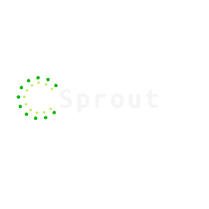

# Sprout

**Sprout is a full stack social media application created to encourage gardeners to exercise  
their green thumb and share their journey with others.**

**Tech used:** HTML, CSS, Bootstrap, JavaScript, Node.js, Express.js, MongoDB

# Install dependencies

`npm install`

---

# Things to add

- Create a `.env` file in config folder and add the following as `key = value`
  - PORT = 2121 (can be any port example: 3000)
  - DB_STRING = `your database URI`
  - CLOUD_NAME = `your cloudinary cloud name`
  - API_KEY = `your cloudinary api key`
  - API_SECRET = `your cloudinary api secret`

---

# Run the application

`npm start`
